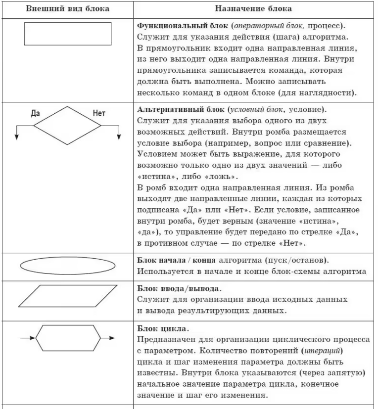

# Лекция 1. Основы алгоритмизации

**Дисциплина:** Основы алгоритмизации и программирования
**Курс:** 1
**Длительность:** 2 академических часа

## 1. Понятие алгоритма

**Алгоритм** — это строго детерминированная последовательность действий (инструкций), определяющая процесс преобразования исходных данных в искомый результат, которая приводит к цели через конечное число шагов.

**Бытовая аналогия:**
Любой рецепт (например, «Как приготовить яичницу») или инструкция по сборке мебели являются примерами алгоритмов. Если строго следовать каждому шагу, результат будет предсказуем.

### 1.1 Свойства алгоритмов

Любой корректный алгоритм должен обладать следующими пятью свойствами:

1.  **Дискретность:** Алгоритм разбит на отдельные законченные шаги (команды), которые выполняются последовательно.
2.  **Определенность (Детерминированность):** Каждая команда должна быть однозначно понятна исполнителю. Недопустимы формулировки типа «насыпь немного соли».
3.  **Результативность:** После завершения алгоритма всегда должен быть получен конкретный результат.
4.  **Конечность:** Алгоритм должен завершаться за конечное число шагов (отсутствие «зацикливания»).
5.  **Массовость:** Алгоритм должен быть применим к разным наборам исходных данных из определенного класса задач.

### 1.2 Способы описания алгоритмов

На практике используются следующие основные формы записи алгоритмов:

| Способ | Описание | Пример |
| :--- | :--- | :--- |
| **Словесно-формульный** | Запись на естественном языке с использованием математических символов. | «Ввести значение A. Присвоить B значение A * 2. Вывести B». |
| **Графический (Блок-схема)** | Изображение последовательности действий с помощью геометрических фигур (блоков), соединенных линиями потока. | См. таблицу нотаций ниже. |
| **Псевдокод** | Формализованный язык, близкий к естественному, но с жестким синтаксисом. | `if x > 0 then print(x)` |
| **Программный код** | Запись на конкретном языке программирования (C++, Python и др.). | `print("Hello")` |

### 1.3 Графическая нотация (Блок-схемы)

Блок-схема является стандартом ГОСТ и используется для визуализации логики программы.

**Основные элементы блок-схем:**

| Фигура | Название | Назначение |
| :--- | :--- | :--- |
| **Овал** | Терминатор | Начало или конец программы. |
| **Параллелограмм** | Ввод/Вывод | Операция ввода данных с клавиатуры или вывода на экран. |
| **Прямоугольник** | Процесс | Вычислительное действие (присваивание, арифметическая операция). |
| **Ромб** | Решение | Выбор направления выполнения в зависимости от условия (развилка). |

**Правила построения:**
- Схема читается сверху вниз и слева направо.
- Линии потока должны быть вертикальными или горизонтальными (поворот 90 градусов).
- В схеме должен быть один блок начала и один блок конца.

## 2. Этапы решения задач на ЭВМ

Процесс превращения математической задачи в работающую программу состоит из 5 стандартных этапов:

### Этап 1: Постановка задачи
Выясняется, что дано (входные данные) и что требуется найти (выходные данные).
- *Типы данных:* Постоянные (константы), Условно-постоянные, Переменные.

### Этап 2: Формализация (Математическая модель)
Задача переводится с естественного языка на язык математических формул и уравнений.

### Этап 3: Выбор или разработка метода решения
Определяется, по каким формулам и зависимостям мы будем считать результат.

### Этап 4: Разработка алгоритма
Составляется блок-схема или псевдокод, описывающий строгую последовательность шагов.

### Этап 5: Реализация (Кодирование)
Запись алгоритма на конкретном языке программирования (например, Python).